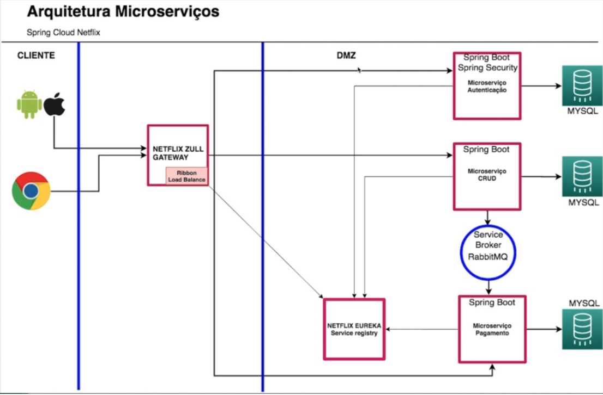

# java-microservice-project-01
Java Microservice Project 01

Project created as a practice of the [Microservices Architecture course with Spring Cloud Netflix] from which I gained knowledge about Microservices Architecture, Service Discovery Netflix Eureka, Service Broker RabbitMQ, Spring Cloud Netflix and Gateway NetFlix Zuul.

 

 
 

**Service Discovery Netflix Eureka**: Client-side service discovery allows services to find and communicate with each other without hard-coding hostname and port. The only ‘fixed point' in such an architecture consists of a service registry with which each service has to register.

**Service Broker RabbitMQ**: Is the most widely deployed open source message broker. With tens of thousands of users, RabbitMQ is one of the most popular open source message brokers. ... RabbitMQ is lightweight and easy to deploy on premises and in the cloud. It supports multiple messaging protocols.

**Spring Cloud Netflix**: Spring Cloud Netflix provides Netflix OSS integrations for Spring Boot apps through autoconfiguration and binding to the Spring Environment and other Spring programming model idioms. With a few simple annotations you can quickly enable and configure the common patterns inside your application and build large distributed systems with battle-tested Netflix components.

**Gateway NetFlix Zuul**: Zuul is an L7 application gateway that provides capabilities for dynamic routing, monitoring, resiliency, security, and more.

## Tech:

* [Java 11]
* [Spring Boot]
* [Spring Security]
* [JWT]
* [Spring Cloud]
* [Spring Data]
* [Lombok]
* [Maven]
* [MySQL]

[Java 11]: <https://docs.oracle.com/en/java/javase/11/?xd_co_f=4f813848-9bb3-47f8-9094-f46bcca78914>
[Spring Boot]: <https://spring.io>
[Spring Security]: <https://spring.io/projects/spring-security>
[JWT]: <https://jwt.io/>
[Spring Cloud]: <https://spring.io/projects/spring-cloud>
[Spring Data]: <https://spring.io/projects/spring-data>
[Lombok]: <https://projectlombok.org/>
[Maven]: <https://maven.apache.org/>
[MySQL]: <https://www.mysql.com/>
[Microservices Architecture course with Spring Cloud Netflix]: <https://www.udemy.com/course/spring-cloud-netflix/>

